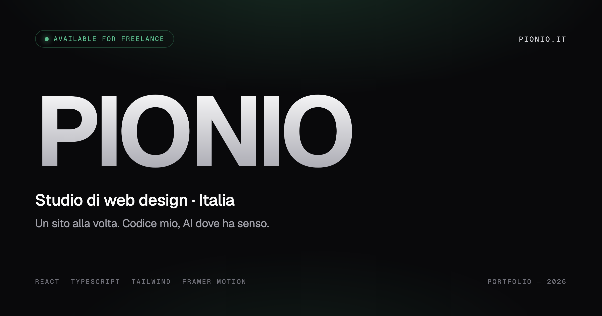

# Pionio — Portfolio



Portfolio site for **Pionio**, a freelance web design & development studio from
Italy. Statically prerendered (SSG), bilingual IT/EN, with a project showcase,
service pages, an SEO blog and a serverless contact form.

🔗 **Live:** https://pionio.it

## Features

- **SSG** — every route is prerendered to HTML at build time with
  `vite-react-ssg` (20 pages: home, 7 case studies, 7 services, 7 articles,
  contact, privacy).
- **Bilingual IT/EN** — custom i18n with `localStorage` persistence and
  auto-detection from `navigator.language`.
- **3D hero** — interactive GLTF model via `@google/model-viewer`, shown only
  where it makes sense (disabled inside the Instagram/TikTok/… in-app browsers
  to avoid WebGL stalls).
- **Motion & WebGL** — `framer-motion` animations (with `LazyMotion` for
  tree-shaking), a custom WebGL aurora background, magnetic buttons.
- **Serverless contact form** — Vercel Edge Function (`api/contact.ts`) with
  validation, HTML escaping, header-injection protection and rate limiting;
  delivery via Resend.
- **Strong SEO/a11y** — per-route meta + canonical + OG/Twitter, JSON-LD
  (Person, WebSite, ProfessionalService), sitemap/robots, skip links, PWA manifest.
- **Dark-only** by design (zinc-950).

## Stack

| Area | Technology |
| --- | --- |
| UI | React 19 + React Router 6 |
| SSG / build | vite-react-ssg + Vite 7 + TypeScript |
| Styling | Tailwind CSS v4 (CSS-first), self-hosted Geist font |
| Animation | framer-motion, WebGL shader |
| Serverless | Vercel Edge Function + Resend |
| Analytics | Vercel Analytics + Speed Insights |
| Hosting | Vercel |

## Development

```bash
npm install
cp .env.example .env.local   # RESEND_API_KEY, NOTIFICATION_EMAIL (server-side)
npm run dev                  # http://localhost:5173
```

### Scripts

| Command | Description |
| --- | --- |
| `npm run dev` | Vite dev server |
| `npm run build` | Type-check + SSG build (prerenders every route) |
| `npm run lint` | ESLint |
| `npm run preview` | Preview the production build |

## Structure

```
src/
├── pages/        # routes (Home, ProjectPage, ServicePage, BlogPost, Contact, Privacy)
├── components/   # sections and UI (Hero, WorksBento, AuroraBackground, ...)
├── lib/          # content data (projects/services/blog), i18n, analytics
├── context/      # LanguageContext (IT/EN)
└── routes.tsx    # route definitions for SSG
api/contact.ts    # contact form edge function (Resend)
```

Content (projects, services, articles) is typed data under `src/lib/` — adding
an entry is a single-file change, no CMS.

## Environment variables

| Variable | Purpose |
| --- | --- |
| `RESEND_API_KEY` | Sends contact-form emails (edge function only) |
| `NOTIFICATION_EMAIL` | Notification recipient |

No secrets are committed: only `.env.example` with placeholders.
